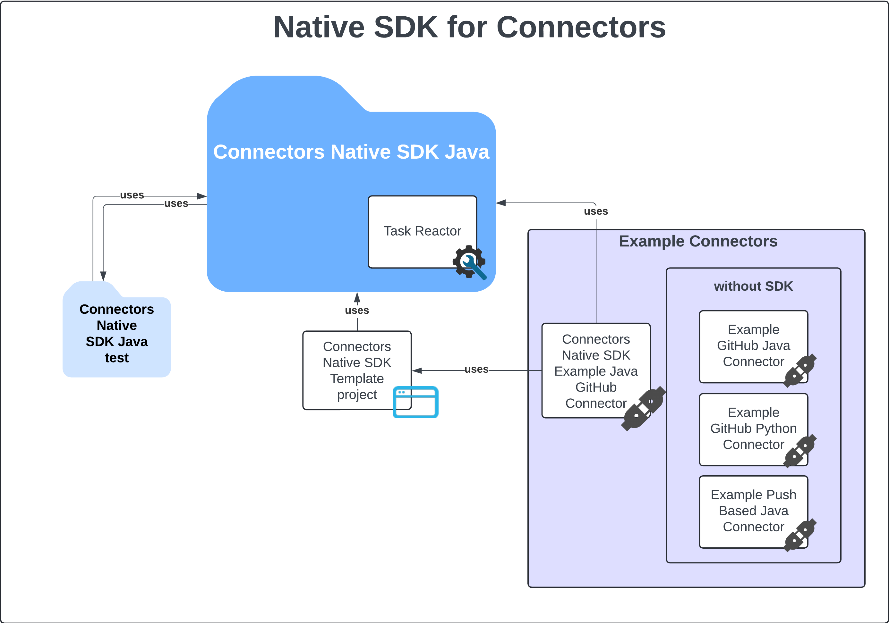

# Native SDK for Connectors

Data is fuel for data clouds. Transferring the data to Snowflake is a step where the whole data journey begins so that 
is why, this step on the Snowflake customer's path is such an essential one.

There are many various ways of importing the data to the Snowflake environment. One of them is connectors. A connector 
is an application that allows data flow from an external source system into Snowflake. We can also distinguish the 
concept of a Native Connector, which in the context of Snowflake is understood as a connector application built on the 
foundations of the [Snowflake Native App Framework][Native Apps docs]. 

**In order to accelerate and standardize the process of developing new Native Connectors, Snowflake would like to introduce
the Native SDK for Connectors which is a set of libraries, developing tools, example connectors and connector template 
projects.**

## Key components

In the diagram below, you can find key components that are listed with a brief description below the diagram.

### Native SDK for Connectors Java

The Java library distributed through the [Maven Central Repository][SDK in Maven Central] which consists of .sql files that deliver database 
objects definitions that are created during the installation of the Connector in the Snowflake environment and a bunch of 
Java classes that mainly serve as procedure handlers. However, among these Java classes, there also are some helper/util 
classes that help in coping with most of the common problems that might be encountered during the development of the Connector 
project. The database objects and Java classes create a coherent whole that makes managing the state of the Connector 
much easier and lets the developers focus on the implementation of the specific external source ingestion logic which 
also is easier to do with the SDK.

Learn more from the [official documentation][Native SDK official docs].

#### Task Reactor

This major component is built into Native SDK for Connectors Java library. It consists of .sql files and Java classes 
embedded into the library that helps in managing and executing work asynchronously, mostly the work related to data 
ingestion. This component offers stability and scalability in work executing. Although this component is dedicated to 
orchestrating the ingestion tasks, it also can be used for executing non-ingestion tasks that require an asynchronous 
way of the execution.

Learn more from the [official documentation][Task Reactor official docs]

### Native SDK for Connectors Java Test

The separate Java library distributed through the [Maven Central Repository][SDK Test in Maven Central] which consists of Java utils helping in 
testing the developed Connectors. These utils are custom assertions and in-memory objects (mocks) for Java classes used 
in the Native SDK for Connectors Java library.

### Connectors Native SDK Template

The template Gradle Java project with inbuilt Native Java SDK that allows the developer to deploy, install, and run the 
sample, mocked source connector right after downloading the template. The template is filled with some code already which 
shows how to use the Native SDK for Connectors Java according to the connector flow defined by the Native SDK for Connectors. 
Reach the [official tutorial][Template tutorial] that will guide through the whole developer flow starting
from cloning the template project, through the implementation process of key functionalities, ending with the deployed 
and running connector in the Snowflake environment!

### Example connectors

These are example projects of connectors that provide the general information on how the connectors, as Native Applications, 
should be created and deployed to the Snowflake environment. Among these connectors there is the one that is built on the 
top of the [Connectors Native SDK Template project](#connectors-native-sdk-template), to show in practice how the template 
should be used to develop a new connector projects. There are also some basic example projects of connectors that show the 
general concept of:

* push-based connectors
* basic pull-based connectors written in Python
* basic pull-based connectors written in Java

Keep in mind that these basic connectors do not use the [Native SDK for Connectors Java library](#native-sdk-for-connectors-java).

## Structure of the repository

* [Native SDK for Connectors Java](#native-sdk-for-connectors-java) - [connectors-native-sdk-java][Native SDK for Connectors Java path]
* [Native SDK for Connectors Java Test](#native-sdk-for-connectors-java-test) - [connectors-native-sdk-java-test][Native SDK for Connectors Java Test path]
* [Connectors Native SDK Template](#connectors-native-sdk-template) - [connectors-native-sdk-template][Connectors Native SDK Template path]
* [Example Connectors](#example-connectors) - [examples][examples]
  * Connectors Native SDK Example GitHub Java Connector - [examples/connectors-native-sdk-example-java-github-connector][Connectors Native SDK Example GitHub Java Connector path]
  * Example GitHub Java Connector - [examples/examples-basic/example-github-java-connector][Example GitHub Java Connector path]
  * Example GitHub Python Connector - [examples/examples-basic/example-github-python-connector][Example GitHub Python Connector path]
  * Example Push-Based Java Connector - [examples/examples-basic/example-push-based-java-connector][Example Push-Based Java Connector path]

## Contributing
Please refer to [CONTRIBUTING.md][contributing].

## License
Please refer to [LICENSE][license]

[Native SDK official docs]: TODO:native_sdk_official_docs_url
[Task Reactor official docs]: TODO:task_reactor_official_docs_url
[SDK in Maven Central]: TODO:sdk_in_maven_central_url
[SDK Test in Maven Central]: TODO:sdk_in_maven_central_url
[Template tutorial]: TODO:template_tutorial_url
[Native Apps docs]: https://docs.snowflake.com/en/developer-guide/native-apps/native-apps-about

[contributing]: ./CONTRIBUTING.md
[license]: ./LICENSE
[examples]: ./examples
[Native SDK for Connectors Java path]: TODO:add_path_to_README
[Native SDK for Connectors Java Test path]: TODO:add_path_to_README
[Connectors Native SDK Template path]: TODO:add_path_to_README
[Connectors Native SDK Example GitHub Java Connector path]: TODO:add_path_to_README
[Example GitHub Java Connector path]: ./examples/example-github-java-connector/README.md
[Example GitHub Python Connector path]: ./examples/example-github-python-connector/README.md
[Example Push-Based Java Connector path]: ./examples/example-push-based-java-connector/README.md
