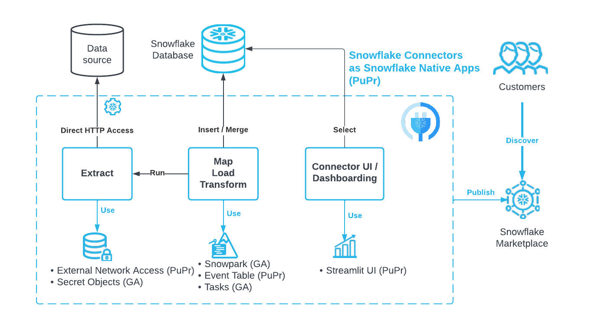

# Snowflake Native SDK for Connectors

## About the Snowflake Native SDK for Connectors

The Snowflake Native SDK for Connectors (Phase 1 of the release) is a set of application templates and quickstarts that show how to build a Snowflake Native App that ingests data from an external data source into Snowflake. These templates cover  pull-based and push-based data integration patterns. 

These templates do not restrict or limit developers. Instead, the templates provide examples of how to use core Snowflake features to ingest data and encapsulate application code within a Snowflake Native App. 

The Snowflake Native App Framework allows providers to publish and monetize a Snowflake Native App on the Snowflake marketplace. Snowflake Native App developers can clone the template repository, modify the boilerplate code, and create their own Snowflake Connectors.

## Pull-based connector templates and quickstarts

### When to use a pull-based pattern

Pull-based patterns are effective when the source data provider does not manage customer data in Snowflake and is not willing to incur COGS for a continuous data share in Snowflake. These patterns are also effective when a source data provider has well-documented APIs that customers can use to replicate and consume data.

### How to use a pull-based pattern

By using a pull-based connector pattern, providers (Snowflake, or a third-party ETL provider) can publish, distribute a Native Connector based on a Snowflake Native App using the Snowflake Marketplace. A Native Connector uses direct external access to connect with the source application. A Native Connector performs outbound authentication, fetches data from the source directly into a customer account, processes and persists the data based on user specified configuration.

 * [Examples repository](https://github.com/snowflakedb/connectors-native-sdk)
 * [Quickstart: Native GitHub Connector (Python)](https://quickstarts.snowflake.com/guide/connectors_github_python)
 * [Quickstart: Native GitHub Connector (Java)](https://quickstarts.snowflake.com/guide/connectors_github_java)

## Push-based connector template and quickstart

### When to use a push-based pattern

Using a push-based pattern is effective when inbound access to the source application through customer firewall is not feasible because of security, performance or governance limitation. This pattern uses an agent and a Snowflake Native Application to allow customers to ingest data changes into Snowflake from behind a firewall .

### How to use a push-based pattern

An agent is a standalone application, distributed as a Docker image, that is deployed in a customer environment and is responsible for sending initial and incremental loads to Snowflake by reading data changes from source CDC stream.

A Snowflake Native App runs within Snowflake, coordinates the integration. The Snowflake Native App is primarily responsible for managing the replication process, controlling the agent state and creating required objects, including the target databases.

 * [Examples repository](https://github.com/snowflakedb/connectors-native-sdk)
 * [Quickstart: Push-based Java Connector](https://quickstarts.snowflake.com/guide/connectors_example_push_based_java)

## Next steps for the Snowflake Native SDK for Connectors

With Phase 2 of the Snowflake Native SDK for Connectors, Snowflake intends to add additional examples, such as include how to manage ingestion jobs, how to generalize common
connector blocks in the form of reusable libraries, and more.  Please note specific examples, new libaries or other additions and updates are subject to change.
If you are interested in the Phase 2 preview, please sign up here: https://www.snowflake.com/connectors-native-sdk 
