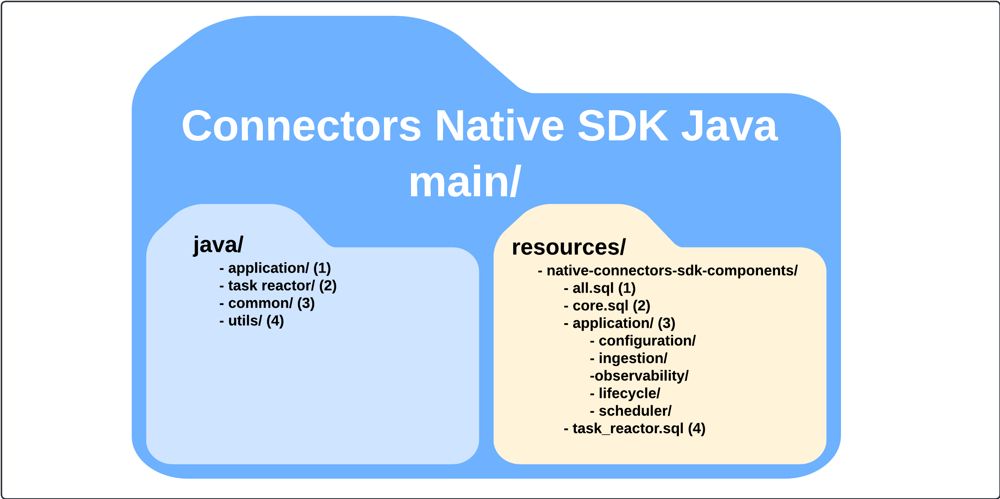
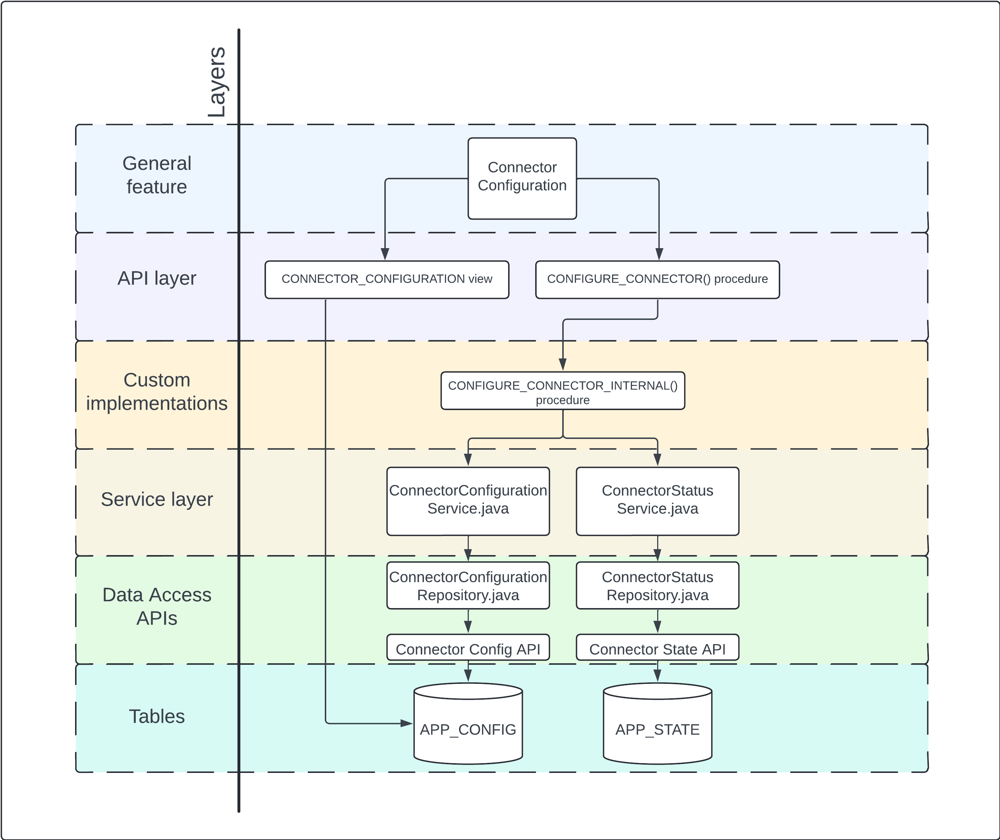

# Native SDK for Connectors Java

Native SDK for Connectors Java is a library that is distributed through the [Maven Central Repository][SDK in Maven Central].
The library significantly helps developers in building Snowflake Native Applications of connectors' type. The SDK 
consists of both Java and sql components. Sql components can be found in the `.sql` files placed in the resources 
directory. They provide the definitions of the database objects, that are created during the installation of the 
Connector. Java components mainly serve as procedure handlers. However, among these Java classes, there also are some 
helper/util classes that provide useful tools to tackle most common use cases. The database objects and Java classes 
create a coherent whole that makes managing the state of the Connector much easier and lets the developers focus on the 
implementation of the specific external source ingestion logic which also is easier to do with the SDK.

Reach the [official documentation][Native SDK official docs] to learn more.

## Project structure

Native Application consists of database objects like tables, views, stored procedures, etc. Most of the stored procedures 
delivered by the Native SDK for Connectors are implemented in Java. However, SQL code that sets up database objects with 
the Java classes as handlers needs to be distributed alongside Java package. In order to achieve this, all files 
containing SQL code are placed into the resources directory, so thanks to that they are available in the artifact JAR 
file. The idea of the packaging strategy is shown in the illustration below:

* `java/`
  * `application/` - this directory contains classes that are mostly procedure handlers, extensions of procedure handlers, and repositories that allow the managing of the connector. These classes are coupled with the Framework Core database objects.
  * `task reactor/` - this directory contains classes that are procedure handlers and repositories for the task reactor database objects.
  * `common/` - this directory contains classes that are commonly used among Framework Core and Task Reactor classes like exceptions or DTO objects.
  * `utils/` - this directory contains classes that are commonly used among Framework Core and Task Reactor classes and mostly help with integration with the Snowflake (procedures calling mechanisms, databases objects validators, etc.)

* `resources/`
  * `all.sql` -  this file executes all feature `.sql` files with the usage of the “EXECUTE IMMEDIATE from file” mechanism.
  * `core.sql` -  this file creates all required base roles, schemas, and database objects (base features) that are required by particular optional features.
  * `application/` - this directory includes files that create database objects for functionalities like configuration, ingestion, observability, lifecycle, and scheduler.
  * `task_reactor.sql` - the file creates all database objects that are the API for task reactor instances management.

### Tests

The SDK is tested by tests at different layers, which are:
* Unit tests - lightweight tests of the Java code logic separated from the Snowflake environment. They can be found in the `src/tests` directory.
* Integration tests - these tests most often test code that is responsible for operations in the Snowflake environment, so they need a Snowflake account connection in order to be executed. These tests create a separate database that is used during tests run. They can be found in the `src/intTests` directory.
* Application tests - the main difference between these tests and integration tests is that these tests test the whole flow of the particular functionality in the environment of the Snowflake Native Application instead of the database. It's required to use Native Application as a test environment because sometimes, Native Applications behavior differs from the standard Snowflake database. These tests can be found in the `src/appTests` directory.

As for integration and application tests they require connection to Snowflake. Connection details can be defined using 
the `.env/snowflake_credentials file`. Application tests directory also contains an empty connector application in 
`src/appTests/resources`. That application is deployed during the test suite execution.

The code is tested with the usage of the Native SDK for Connectors Java Test library which consists of Java utils 
helping in testing the developed Connectors. These utils are custom assertions and in-memory objects (mocks) for Java 
classes used in the Native Java SDK.

## Application areas supported by the SDK

The Native SDK for Connectors helps developers cover many crucial connector application areas by delivering appropriate 
mechanisms (tables, views, procedures etc.). Among these areas we can mention:
* Configuration (Wizard) - the SDK defines the division of connector configuration flow into 3 main steps where logically different configurations are provided:
  * Prerequisites - The prerequisites step is the first step of the wizard phase of the connector. This step is completely optional, but it is recommended, if the end user needs to perform some additional setup outside of the native app or even the whole Snowflake context. An example of this could be setting up authentication and authorization in the source system from which the data will be ingested.
  * Connector configuration - the first required step of the wizard phase is connector configuration. It ensures that the connector has the configuration of the objects common to all connector types, regardless of the actual source system and domain.
  * Connection configuration - it is a wizard step that comes directly after the connector configuration. This step allows the user to specify properties required for establishing a connection with the source system to start ingesting data into Snowflake.
  * Finalize configuration - it is the last step of the Wizard, it comes directly after the connection configuration step. This step allows the user to provide any custom configuration that was not included during the previous steps of the configuration. Furthermore, it can be used to do some final touches when it comes to configuration, like creating the sink database, starting task reactor etc.

* Ingestion management - before the connector starts ingesting the data it needs some information about that data like the ID of the data in the source system. In order to help developers in defining, localizing, and tracking the ingested data, the SDK introduces some kind of abstraction:
  * Resource - the ingested data in the source system
  * Resource ingestion definition - defines the ingestion settings for the particular resource type
  * Ingestion process - the trackable logical unit of the particular resources’ ingestion
  * Ingestion run - single unit of work in order to complete the ingestion process

* Observability - the SDK provides a bunch of database objects like views and procedures that allow the connector user to observe some sort of data stored by the connector like the configuration or to see the state of the application. The user is also allowed to track the data related to the ingestion like ingestion stats (the aggregated data about ingestion processes and ingestion runs), defined resource and ingestion definitions data.

* Application lifecycle management - the SDK provides mechanisms (mainly procedures) that helps with managing the state of the connector. Apart from the configuration mechanisms described above, there are procedures that allow the user to pause and resume the connector, which means that all database tasks are suspended or resumed. The SDK manages its own tasks, but there is a possibility to extend these procedures to manage custom database objects created by the connector developers additionally.

* Work orchestration - one of the most challenging functionalities to be implemented by a connector developer is work orchestration and scheduling. In order to face this challenge, the SDK provides the following default mechanisms:
  * Task Reactor - the scalable component that uses Snowflake Tasks to perform work simultaneously. The developer can define the logic of how the work should be executed and the payload that is provided when the work is to be performed. This mechanism is expected to be used to perform work related to ingestion, but it’s a universal mechanism that can be used for any different purpose, like a message queue. The connector can use multiple Task Reactor instances.
  * Work Scheduler - This mechanism triggers the ingestion of resources at appropriate times according to their configuration. The SDK provides components that allow easy integration of the Scheduler with the Task Reactor instance.

## Layers organization

Each general functionality provided by the SDK can be broken down into smaller components assigned to appropriate 
layers, such as:
* General feature layer - the name of the feature
* API layer - entry points to the functionality like views and procedures
* Custom implementation layers - in case of procedure the SDK provides the mechanism to override the default behavior of the procedure by implementing callback procedures from the default main procedure  or overriding the whole main procedure.
* Service layer - consists of Java classes that help with the procedure logic execution
* Data Access APIs layer - consists of Java classes that serve as repositories for appropriate tables
* Tables layer - consists of tables that store the data used/required by the functionality

The example division into layers of the Connector Configuration functionality is presented in the diagram below:

## Task Reactor

This component consists of `.sql` files and Java classes embedded into the Native Java SDK library that helps with managing 
and executing work asynchronously, mostly the work related to data ingestion. This component offers stability and 
scalability in work executing. Although this component is dedicated to orchestrating the ingestion tasks, it can be also 
used for executing non-ingestion tasks that require an asynchronous way of execution.

Task reactor is a separate module - the source code can be found in [com/snowflake/connectors/taskreactor][Task Reactor dir path]
Task reactors’ queue and dispatcher are based on [Snowflake Streams][Snowflake Stream Docs] with [Snowflake Tasks][Snowflake Tasks Docs] 
and will be triggered every one minute due to the refresh time limitation. The task Reactor will be active only when 
there is data in the input queue, to allow the warehouse to save some credits.

## How to use

Here are the methods of using the SDK in the new project.

### Library in Maven Central

The library is available in the [Maven Central Repository][SDK in Maven Central]. You can add it as a dependency to your 
project if you start in from scratch, but remember that you will need to take care of the whole process of connector 
building and deployment to Snowflake.

### Connectors Native SDK Template

The library is build into the [Connectors Native SDK Template project][Connectors Native SDK Template path] which allows 
the developer to start the project with already prepared common code. The developer is only required to implement the 
most important area of the connector like the configuration and ingestion. Moreover, the template provide some tools 
that help with building and deploying the connector to Snowflake environment. It's a recommended way of starting a new 
project with the Native SDK for Connectors Java library.

You can also check the [Connectors Native SDK Example Java GitHub Connector][Example Connector path] to find out how the
template is used in practice.

[Native SDK official docs]: TODO:native_sdk_official_docs_url
[Task Reactor official docs]: TODO:task_reactor_official_docs_url
[SDK in Maven Central]: TODO:sdk_in_maven_central_url
[Snowflake Stream Docs]: https://docs.snowflake.com/en/user-guide/streams-intro
[Snowflake Tasks Docs]: https://docs.snowflake.com/en/user-guide/tasks-intro

[Connectors Native SDK Template path]: TODO:add_path_to_readme
[Example Connector path]: TODO:add_path_to_readme
[Task Reactor dir path]: ./src/main/java/com/snowflake/connectors/taskreactor