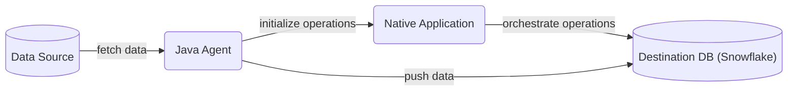
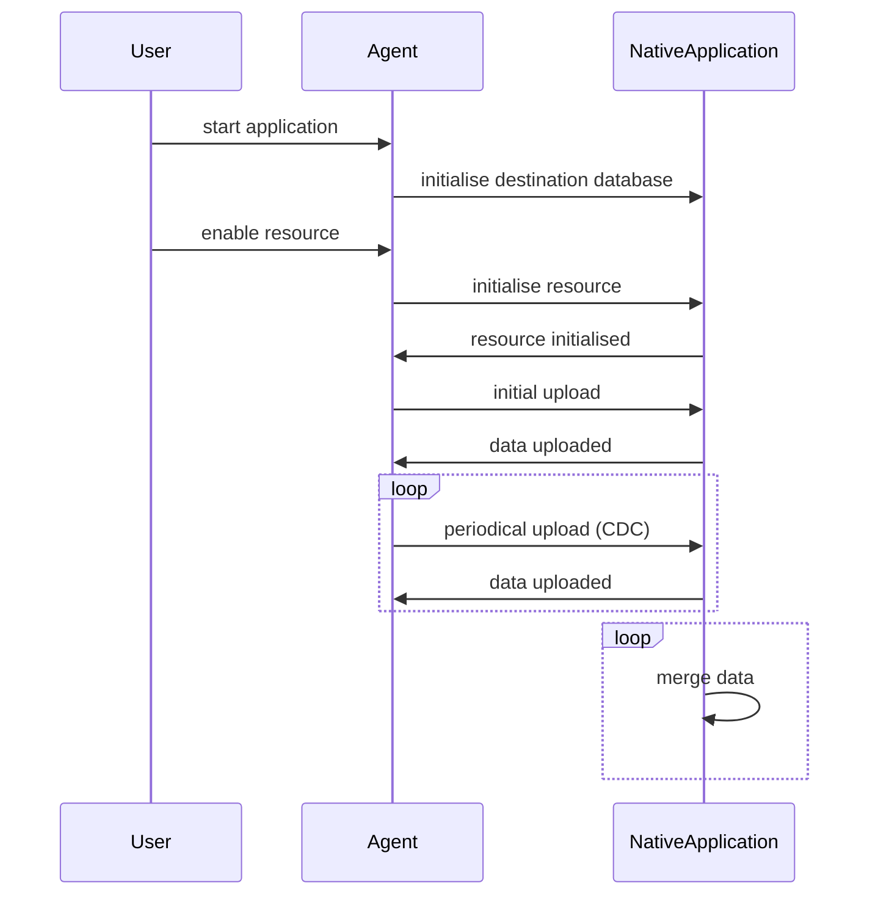
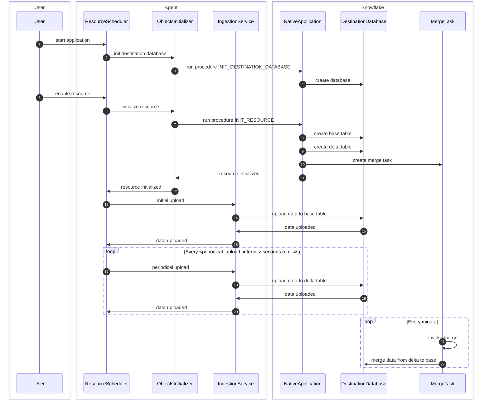

# Snowflake example push based connector

This repository contains sample push based connector ingesting random data to Snowflake.

## Prerequisites

- Basic knowledge of [Snowflake Native Apps](https://docs.snowflake.com/en/developer-guide/native-apps/native-apps-about)
- Basic knowledge of Java
- Snowflake user with `accountadmin` role

## You will learn
- Creating Native Applications in Snowflake
- Ingesting data to Snowflake using snowflake-ingestion-sdk
- Running Snowflake procedures using snowflake-jdbc
- How to optimize merge for the CDC scenario using deferred merge approach

## Prepare your local environment

- Install Java 11 or later
- Install [snowsql](https://docs.snowflake.com/en/user-guide/snowsql)
- Configure snowsql to allow using [variables](https://docs.snowflake.com/en/user-guide/snowsql-use#enabling-variable-substitution) (`variable_substitution = True`)
- Configure snowsql to [exit on first error](https://docs.snowflake.com/en/user-guide/snowsql-config#exit-on-error) (`exit_on_error = True`)
- Clone example-push-based-java-connector repository

## Connector overview




This connector consist of Java Agent and Native Application.
Java Agent acts as a application which is close to a data source, it fetches data from the data source and pushes the data to Snowflake.
### Native Application
- runs [natively](https://docs.snowflake.com/en/developer-guide/native-apps/native-apps-about) in Snowflake
- contains a [stored procedure](https://docs.snowflake.com/en/sql-reference/stored-procedures-overview) which initialises resources by creating all objects in database needed for deferred merge
- contains [Streamlit](https://docs.streamlit.io/) UI which visualises data
- contains the following database elements:
  - schemas:
    - `PUBLIC` - versioned, used to store all public procedures
    - `TASKS` - stateful, used for tasks
  - procedures:
    - `INIT_DESTINATION_DATABASE` - procedure which is used to create destination database for resources
    - `INIT_RESOURCE` - procedure which initialises resource, it creates the following elements in destination database:
      - base table
      - delta table
      - view which contains merged data from base and delta tables
      - task which periodically merges data from delta to base table
  - destination database - database for all resource data, it is created outside the Native Application by `INIT_DESTINATION_DATABASE` procedure

### Java Agent
- simple Java application
- connects to the Native Application
- runs `INIT_DESTINATION_DATABASE` procedure on startup
- initialises new resources using Native Application's procedure `INIT_RESOURCE`
  - uses [snowflake-jdbc](https://docs.snowflake.com/en/developer-guide/jdbc/jdbc) library for calling stored procedure
- ingests data to snowflake
  - uses [snowflake-ingest-sdk](https://docs.snowflake.com/en/user-guide/data-load-snowpipe-streaming-overview) library for ingesting data
- contains CLI for enabling new resources


## Project structure

### Native app module
Contains files which are needed to create native application in snowflake
- `manifest.yml` - Manifest file required by the native apps model.
- `setup.sql` - This script includes definition of all components that constitutes the connector including procedures, schemas and tables.
- `streamlit_app.py` - File which contains the UI of the connector.
- `deploy.sql` - Script which uploads `manifest.yml`, `setup.sql` and `streamlit_app.py` to snowflake.
- `install.sql` - Script which creates native application from the files uploaded by `deploy.sql` script.

### Java agent module
Contains java files that constitute the Agent application and gradle files that are needed to build the application.


## Connector configuration

### Snowsql configuration
This quickstart uses some convenience scripts for running necessary commands. Those scripts use snowsql. Before
proceeding further you need to configure snowsql connection to your environment according to [documentation](https://docs.snowflake.com/en/user-guide/snowsql-start#using-named-connections).


### Generating Pubic and Private Keys
Java Agent uses snowflake-ingestion-sdk library which uses [key pair authentication](https://docs.snowflake.com/en/user-guide/key-pair-auth).
In order to set up the connection you need to generate Public and Private Keys. To achieve it, run the following commands:
```sh
openssl genrsa 2048 | openssl pkcs8 -topk8 -inform PEM -out rsa_key.p8 -nocrypt
openssl rsa -in rsa_key.p8 -pubout -out rsa_key.pub
```
The commands will create 2 files with public key (`rsa_key.pub`) and private key (`rsa_key.p8`). The keys will be used in next steps.

### Configure user in snowflake
Configure public key for your user by running the following sql command in Snowflake worksheet. Use the public key generated in previous step.
```sql
ALTER USER <your_user> SET RSA_PUBLIC_KEY='<Your Public Key>';
```

If your user doesn't have password configured, run the following command to set the password.
```sql
ALTER USER <your_user> SET PASSWORD = '<Your Password>' MUST_CHANGE_PASSWORD = FALSE;
```
The password will be needed for Java Agent to connect to Native Application using snowflake-jdbc.

### Native application configuration
In order to create native application you need to adjust values in `Makefile` script for:
- `WAREHOUSE` - warehouse that will be used to create the app
- `CONNECTION` - name of snowsql connection defined in previous step

You can also change the rest of the properties:
- `APP_NAME`
- `APP_VERSION`
- `STAGE_DB`
- `STAGE_NAME`

Those values will be used by all scripts used in this quickstart.

Note: after changing `APP_NAME` or `WAREHOUSE` you will need to adjust `native_application.database_name` or `warehouse` properties in next step

### Java agent configuration
In order to build Java Agent and connect it to Snowflake you need to edit the following properties in `/example-push-based-java-connector-agent/src/main/resources/connector.properties`:
- `account` - snowflake account name
- `user` - snowflake username
- `jdbc.password` - snowflake password for given user, it will be used to connect to snowflake via jdbc
- `warehouse` - warehouse which was used to create native application, it has to be the same value as `WAREHOUSE` in Makefile
- `ingestion.host` - snowflake host
- `ingestion.private_key` - private key generated in previous step with removed whitespaces (one-line string). To make sure that your private key property does not contain any whitespace at the beginning and at the end you can wrap it with quotes.
- `jdbc.url` - jdbc url which should contain correct snowflake host
- `native_application.database_name` - this property has to be changed if `APP_NAME` in Makefile was changed, it should have `APP_NAME` value with `_INSTANCE` suffix


## Connector logic
When user starts Java Agent application, it connects to Native Application and runs `INIT_DESTINATION_DATABASE` procedure.
Then CLI is launched and user can enable resource using appropriate command.
When a resource is enabled, Java Agent performs the following steps:
- Initialises table - connects to Native App and runs INIT_RESOURCE procedure
- Runs initial upload - loads some records from data source and uploads them to base table
- Schedules periodical upload (CDC) - loads and uploads some records to delta table every 1 minute

In the meantime, on native app side, the merge task is invoked. It merges data from delta to base table.

### Simplified sequence diagram


### Detailed sequence diagram



## Build the connector

### Overview
Build step for the app consist of:
1. Creating a new `sf_build` directory on local machine for Native App artifacts
2. Creating a new `sf_build_java` directory on local machine for Java Agent artifacts
3. Copying of `Agent.jar` to `sf_build_java` folder
4. Copying of `manifest.yml` to `sf_build` folder
5. Copying of `setup.sql` to `sf_build` folder
6. Copying of `streamlit_app.py` to `sf_build` folder

The `sf_build` serves as the source of truth about the Native Application definition.

### Building
To build the connector execute a convenience script:
```sh
make build
```

## Deploy the connector
In this step we will deploy the connector to a Snowflake account.

### Overview

Deployment step consists of:
1. Creating a database and stage for app artifacts
2. Uploading the `sf_build` content to the newly created stage
3. Creating an application package using the data from the stage


### Deploy the app
To deploy the connector execute a convenience script:
```sh
make deploy
```


## Installing the connector

In this step you will install the connector. The installation is encapsulated in a convenience script `install.sql`.

### Overview

Installation step consists of:
1. Creating a new application using application package which was created in previous step
2. Granting necessary privileges to the application

### Running the installation script

To install the connector using the convenience script run the following:
```shell
make install
```

### Setting Account level privileges

To configure account level privileges enter Apps tab and select your connector. 
In the pop-up window of new connector, choose option `Grant Privileges` as it is shown in the image below.


###  Configuring connectors destination_database

First you need to specify what database should be used for storing data pushed by Agent. 
Destination database has to be defined by the same string as `destination_database.database_name` in `/example-push-based-java-connector-agent/src/main/resources/connector.properties`
After providing `destination_database` confirm it by using `configure` button.


## Using Java Agent to enable resources

To run Java agent run the following command:
```shell
make run_agent
```

This command runs agent's command line interface. The following commands are available to use:
- `enable <resource_name>` - initialises resource and runs initial and periodical upload, example usage: `enable first_resource`
- `disable <resource_name>` - disables periodical upload of given resource, example usage: `disable first_resource`
- `quit` - disables all active resources and quits application


## Using Streamlit app to visualise data

At this point, when the application is deployed and installed, you should be able to see the UI streamlit application.

Navigate to applications option in menu, then find and open application with your application name.
After enabling a resource using Java Agent `enable resource_name` command, you will see a bar chart with count of elements in all tables.


You can check the `Refresh automatically` checkbox to enable periodical refreshing of the page - this way you will see rising charts when the data is being ingested.

## Run integration test

Example-push-based-java-connector repository contains also a module with integration test.

### Overview
This test checks if the whole application flow works as expected. It performs the following steps:
- builds the connector
- deploys the connector
- installs the connector
- initializes destination database
- initializes new resource
- performs initial upload
- performs single iteration of periodical upload
- executes merge task
- drops the connector application and all database elements that were created

### Running the test
The integration test can be run using a simple make command:
```shell
make test
```
